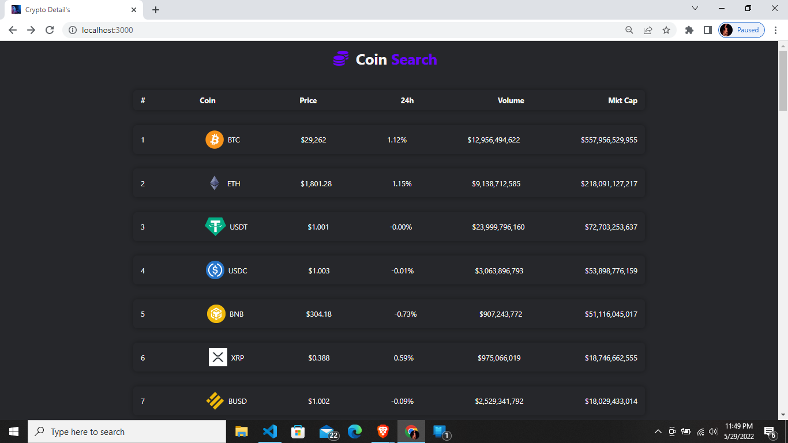
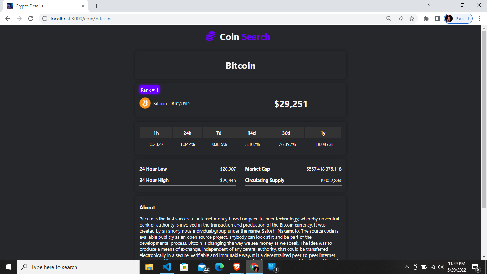
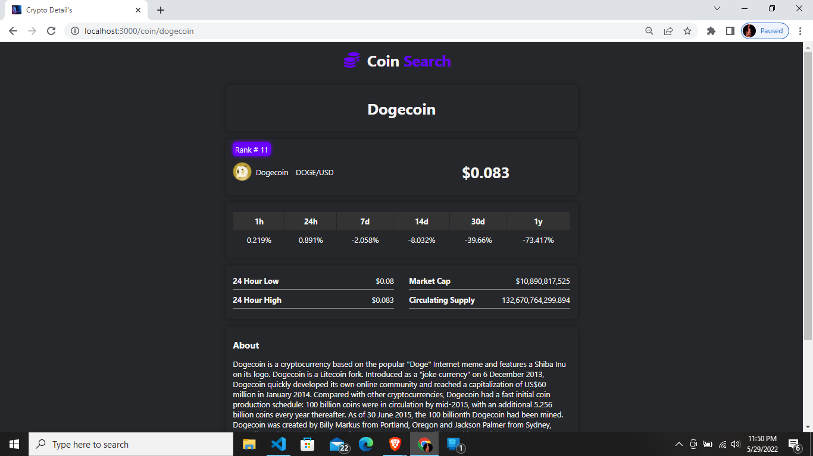

# Crypto Details
Today each person know's about crypto currency so to check each price manually it's really hard to do so I have tried to create react webside such that each person can see top 50 coin price's with their 24 hour up and down as well as market cap and volume of it.
And If you clicked on any coin then it will show you detail's like 24 hour high and low with current supply of it also show's history regarding of coin.

### Live hosted on netlify
![https://multiple-crypto-detail.netlify.app/]

## Images

### First Image

### Second Image

### Third Image
